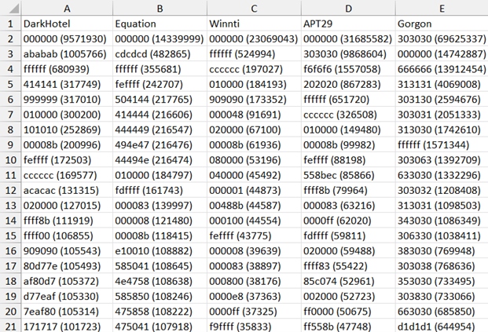
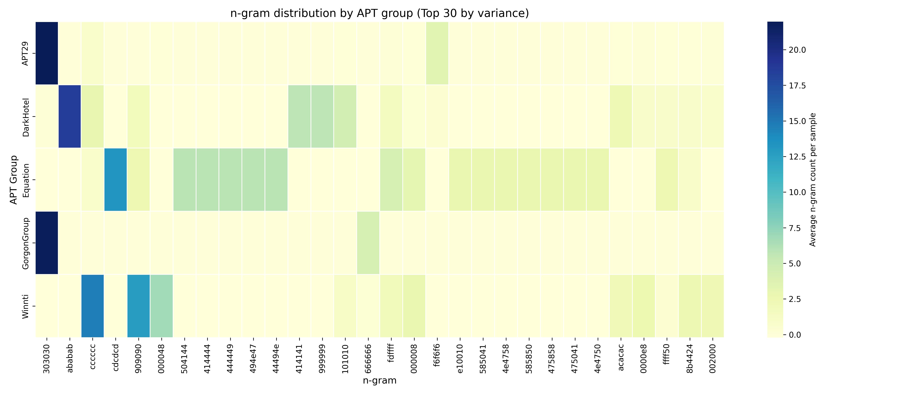
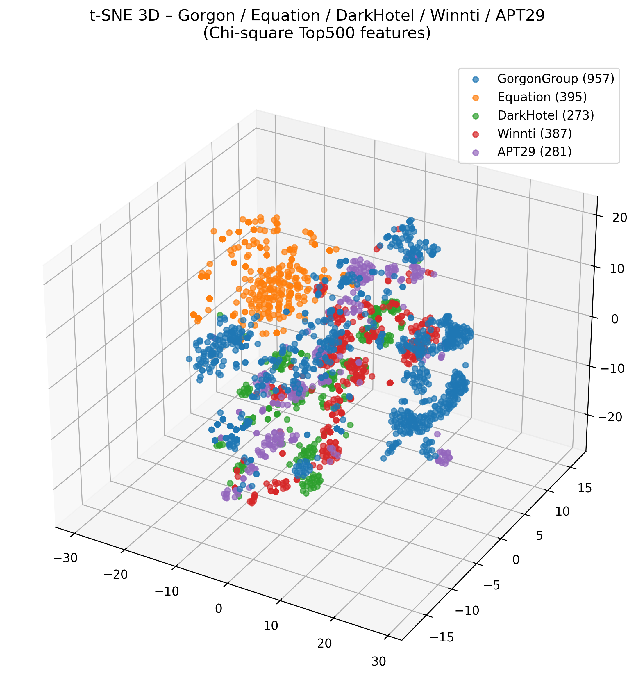
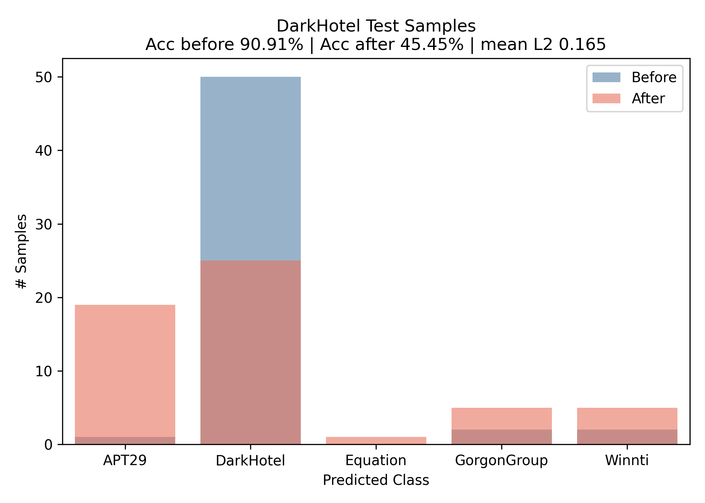
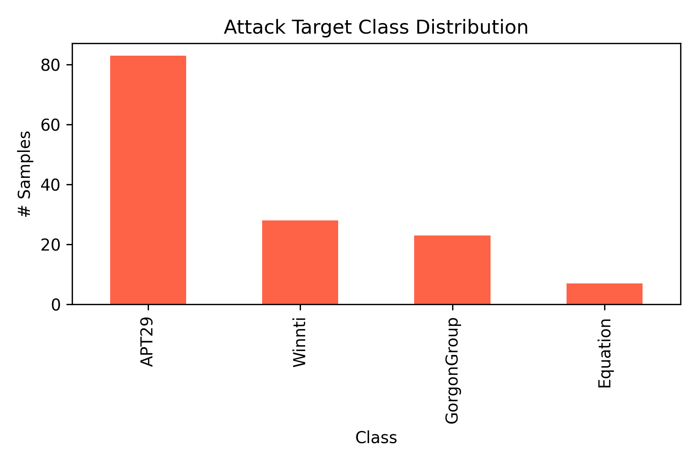

# APT Malware Classification and Adversarial Attack Project

This project analyzes and classifies malware from five nation-state APT (Advanced Persistent Threat) groups, and investigates adversarial attacks on malware classifiers using the `secml` library.

---

## Dataset

Malware samples from five APT groups:

| APT Group        | Country       | Samples |
|------------------|---------------|---------|
| APT29            | Russia        | 281     |
| DarkHotel        | North Korea   | 273     |
| Equation Group   | USA           | 395     |
| Gorgon Group     | Pakistan      | 961     |
| Winnti           | China         | 387     |

- **Source:** [APTMalware GitHub Repository](https://github.com/cyber-research/APTMalware/tree/master)

---

## Preprocessing

The malware hashes were collected from multiple threat intelligence reports, and the corresponding samples were retrieved via VirusTotal. Several randomly selected hashes from the dataset were confirmed to be actual malware when rechecked on VirusTotal.

### 1. N-gram Feature Extraction

- Disabled `.exe` functionality from binaries.
- Converted binaries to 3-gram byte sequences.
- Extracted top 500 frequent 3-grams per group.

> Script: `make_vectors_darkhotel.py`

---

### 2. Group-wise Top 20 N-gram Extraction

- Identified the top 20 3-grams per group.

 
 

> Script: `extract_top20_ngrams_by_group.py`

---

### 3. Merge and Filter Features

- Merged 5 groups' 3-gram vectors into a unified CSV.
- Removed common features appearing in 30%+ of samples across all groups.
- Scored n-grams based on group-specificity.
- Selected top 500 distinctive features.

> Script: `build_merge_filter_5groups.py`

---

## Visualization

### N-gram Heatmap

- Visualized top 30 high-variance n-grams across groups.

 
 

> Script: `apt_ngram_heatmap.py`

---

### Sample Distribution (t-SNE)

- Reduced 500-dim vectors to 3D using t-SNE.
- Displayed clustering of group samples.
  

 

> Script: `plot_tsne_filtered_5groups.py`

---

## Classification & Adversarial Attack

### Defense Model

- Model: RBF-SVM
- Samples: Training(1,834), Test(459)
- Input: 3-gram vectors, Label: APT group
- Best hyperparameters (via 10-fold CV): C = 100, γ = 10
- Accuracy: Training(98.7%), Test(96.7%)
---

### Adversarial Attack (DarkHotel)

- Targeted samples: All 273 DarkHotel samples 
- Attack type: PGD-LS (L2-norm based)
- Attack success rate: 51.6%
- Mean L2 distance of successful attacks: 0.165
- Number of successful adversarial samples: 141

 

#### Comparison of predicted labels before and after PGD-LS on DarkHotel test samples (55)
  - Before attack (blue): 91% were correctly predicted as “DarkHotel”
  - After attack (red): Only 45% remained as “DarkHotel”; the rest were misclassified (mostly as APT29)
    

 

#### Target class distribution after successful PGD-LS attacks (from 141 adversarial samples)
  - The majority were misclassified into APT29 (over 83 samples)
  - Followed by Winnti, GorgonGroup, and Equation

 

> Script: `run_pgdls_darkhotel_evasion.py`

---

## Robust Classifier Training

### Goal

Build an APT malware classifier robust to adversarial evasion.

---

### Method 1: Adversarial Training

- Added adversarial DarkHotel samples (`darkhotel_adv_vectors.csv`) to training data.

---

### Method 2: PGD + PCA + Deep Learning

- Dataset: 2293 original + 167 adversarial samples = 2460 total
- Mini-batch size = 128 (64 clean + 64 perturbed per batch)
- One training epoch includes 20 updates
- Applied PCA for dimensionality reduction

> Script: `robust_malware_classifier.py`

---

## Requirements

- Python 3.8+
- Recommended libraries:
  - `numpy`, `pandas`, `matplotlib`, `seaborn`
  - `scikit-learn`
  - `secml` (https://arxiv.org/pdf/2104.12848)

---

## Disclaimer

This project is intended for academic research only.  

---
